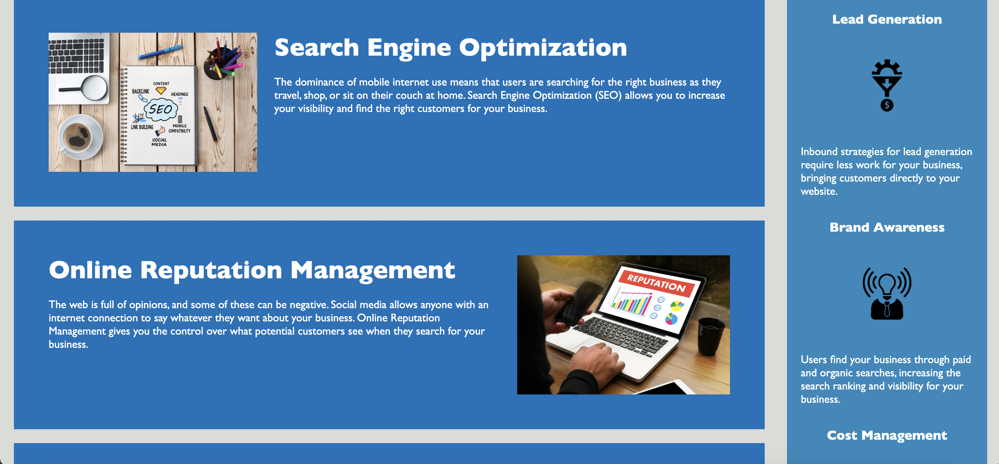

# __HoriSEOn Marketing Agency__
## Shane O'Connell
## Unit One HW - due: 12/3/2020
## Project Status: Complete

### __Description__
    Our assignment this week was to "clean up" the code of a client named HoriSEOn SEO Marketing. While their homepage was clean, the code building that page could use a "light dusting," so to speak.  




### __Client Request__
    As a marketing agency, 
    I WANT a codebase that follows accessibility standards
    SO THAT our own site is optimized for search engines.

        GIVEN a webpage meets accessibility standards
    WHEN I view the source code
    THEN I find semantic HTML elements
    WHEN I view the structure of the HTML elements
    THEN I find that the elements follow a logical structure independent of styling and positioning
    WHEN I view the image elements
    THEN I find accessible alt attributes
    WHEN I view the heading attributes
    THEN they fall in sequential order
    WHEN I view the title element
    THEN I find a concise, descriptive title

### __Course of Action__
    Focusing on accessibility tags and semantic HTML structure. 

  
``` <body>
        <header>
            <h1>Hori<span class="seo">seo</span>n</h1>
            <nav>
                <ul>
                    <li>
                        <a href="#search-engine-optimization">Search Engine Optimization</a>
                    </li>
                    <li>
                        <a href="#online-reputation-management">Online Reputation Management</a>
                    </li>
                    <li>
                        <a href="#social-media-marketing">Social Media Marketing</a>
                    </li>
                </ul>
            </nav>
        </header>
```
    


